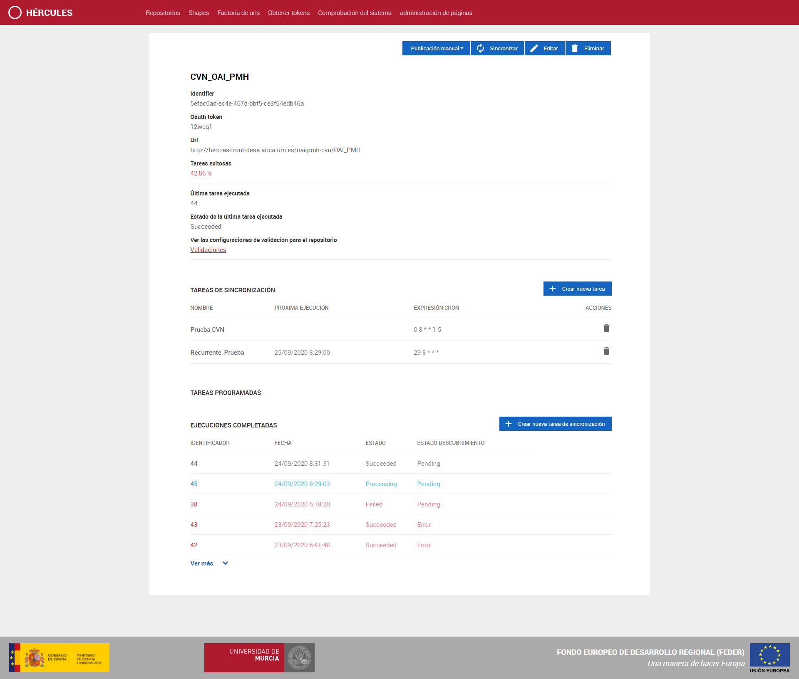
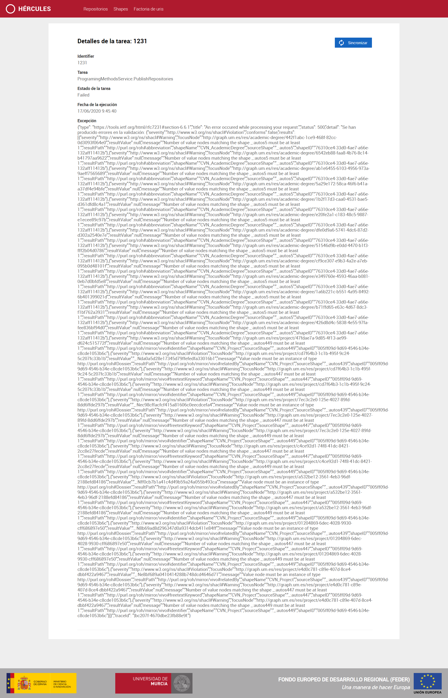
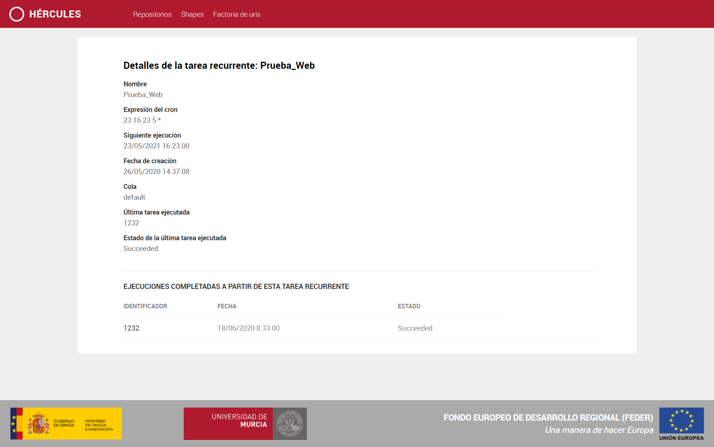
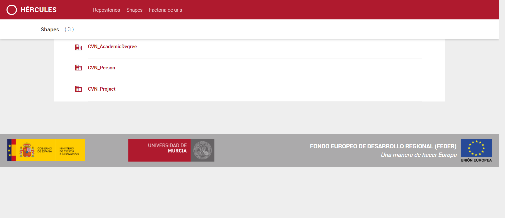
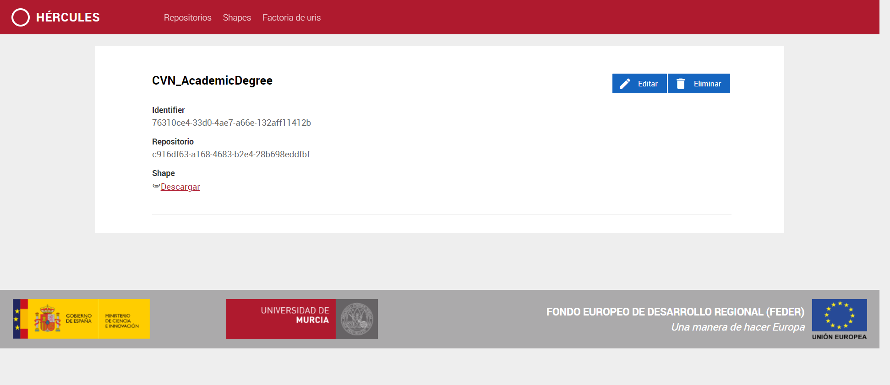
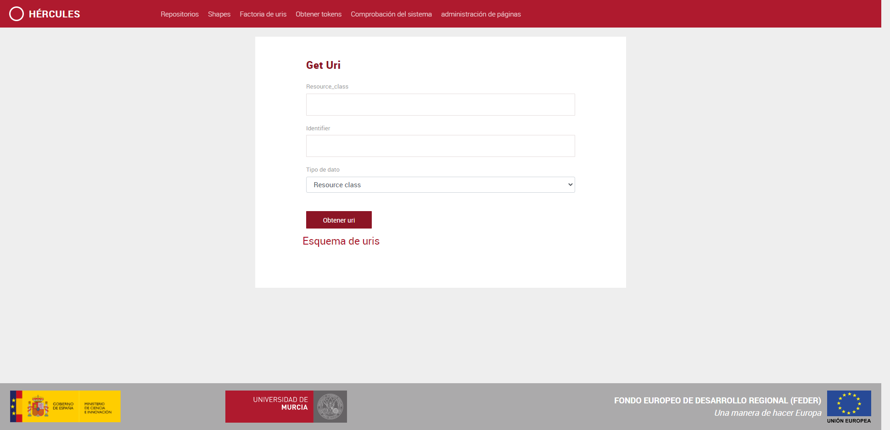

# Sobre FrontEndCarga

Accesible en pruebas en esta dirección: http://herc-as-front-desa.atica.um.es/carga-web.

## Manual
Este proyecto es una interfaz web desarrollada con el patrón MVC. Al acceder a la web vemos un menú en la parte superior desde la que se puede acceder a los repositorios, los shapes y las operaciones del urisFactory.
### Página principal - listado de repositorios
La página de inicio de la web es el listado de los repositorios, desde este listado se puede crear un repositorio nuevo con el botón + que se encuentra por la mitad de la página. 
Al acceder a un repositorio podemos ver los shapes que tiene vinculados ese repositorio, así como las tareas de sincronización programadas y ejecutadas que ha tenido el repositorio, como se muestra a continuación.

Desde esta pantalla se pueden crear tanto nuevos shapes asociados al repositorio, como nuevas sincronizaciones. Además se puede editar o eliminar dicho repositorio, además de modificar la información asociada a él (shapes y tareas):
 - Modificar shape.
 - Eliminar shape.
 - Eliminar tarea programada.
 - Eliminar tarea recurrente.
También se puede acceder a la información de las tareas, tanto de tareas de única ejecución como las tareas recurrentes como se muestra en los apartados siguientes.
### Vista de una tarea
En la pantalla que se muestra a contiación se muestran los datos de una tarea ejecutada y un botón con el cual se puede volver a lanzar esta tarea. Los datos motrados son:
 - Identificador de la tarea.
 - La tarea ejecutada.
 - El estado de la tarea, que puede ser que se haya ejecutado con éxito o esté en estado fallido.
 - La fecha de la ejecución en formato UTC.
 - Error que haya causado el fallo de la tarea.

### Vista de una tarea recurrente
En la siguiente imágen se muestran los datos de una tarea recurrente:
 - El nombre de la tarea recurrente.
 - La expresión del cron que indica la recurrencia de dicha tarea.
 - La fecha de la próxima ejecución.
 - El identificador de la última tarea ejecutada, en el caso de que se haya ejecutado alguna tarea.
 - El estado de la última tarea ejecutada, en el caso de que se haya ejecutado alguna tarea.
 - Por último se muestra un litado de las tareas ejecutadas a partir de la tarea recurrente.

### Listado de shapes
Listado global de shapes. Desde este listado se pueden acceder a todos los shapes que hay creados

Para poder acceder a su información y poder editarla o eliminar el shape tendremos que acceder a él.

### Factoria de uris
Interfaz desde la que se puede:
 - Obtener una uri.
 - Descargar el archivo el archivo de configuración de las uris.
 - Reemplazar el archivo de configuración de uris.
 - Eliminar una estructura de uris.
 - Añadir una nueva estructura de uris.
 
 A la hora de crear una estructura uri nos aparecerá un texto editable en el que aparece una estructura uri a modo de ayuda, como se ve en la siguiente imágen

